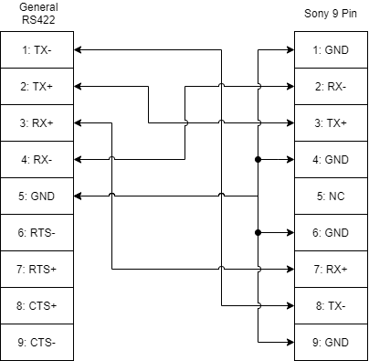

# Sony9PinRemote

RS422 Sony 9-Pin Protocol Remote Controller of VTRs for Arduino

## Usage

```C++
#include <Sony9PinRemote.h>

Sony9PinRemote::Controller deck;

void setup()
{
    // serial should be set and attach as follows
    Serial1.begin(Sony9PinSerial::BAUDRATE, Sony9PinSerial::CONFIG);
    delay(2000);

    deck.attach(Serial1);

    // get device status
    deck.status_sense();
    if (deck.parse_until(1000)) // wait until response comes (timeout = 1000ms)
    {
        if (!deck.is_media_exist())
            Serial.println("ERROR: there is no media!");

        if (!deck.is_remote_enabled())
            Serial.println("ERROR: remote control is disabled!");

        if (!deck.is_disk_available())
            Serial.println("ERROR: removable media is not available!");

        if (!deck.is_stopping())
        {
            deck.stop();
            deck.parse_until(1000);
        }

        deck.device_type();
        if (deck.parse_until(1000))
        {
            Serial.print("device type = ");
            Serial.println(deck.device(), HEX);
        }
        else
            Serial.println("ERROR: device type request failed!!");
    }
    else
    {
        Serial.println("ERROR: device status request failed!!");
    }
}

void loop()
{
    // receive and parse reponse packet
    deck.parse();

    // if previous command has completed (response has come)
    if (deck.ready())
    {
        static bool b = false;
        if (b) deck.play();
        else   deck.stop();
        b = !b;
        delay(2000);
    }
}
```

## Connection

We need five pins of RS422/485 output at least (TX+, TX-, RX+, RX-, and GND) to connect to a deck controller with Sony 9 Pin protocol. General pin connection can be like this. But this may be changed depending on the controller.



If you want to connect to the deck controller from your PC, the connection will be like this.


## References

- P.30 of [HyperDeck Manual](https://documents.blackmagicdesign.com/UserManuals/HyperDeckManual.pdf)
- [command list](https://www.drastic.tv/support-59/legacysoftwarehardware/37-miscellaneous-legacy/180-vvcr-422-serial-protocol)
- [connection diagrams](http://www.dspj.co.jp/~manuals/mergingtechnologies/PMX_v5/EnglishManual/Sony9pin%20Wiring%20Chart.pdf)


## Supported Commands

- X : Supported
- \* : Supported Encoding Only
- Blank : Not Supported


|   | Command (HEX)                   | Response (HEX)                     | Note                                 |
|---|---------------------------------|------------------------------------|--------------------------------------|
| X | [00 0C] Local Disable           | [10 01] Ack                        |                                      |
| X | [00 11] Device Type Request     | [12 11] Device Type                |                                      |
| X | [00 1D] Local Enable            | [10 01] Ack                        |                                      |
| X | [20 00] Stop                    | [10 01] Ack                        |                                      |
| X | [20 01] Play                    | [10 01] Ack                        |                                      |
| X | [20 02] Record                  | [10 01] Ack                        |                                      |
| X | [20 04] Standby Off             | [10 01] Ack                        |                                      |
| X | [20 05] Standby On              | [10 01] Ack                        |                                      |
| X | [20 0F] Eject                   | [10 01] Ack                        |                                      |
| X | [20 10] Fast Fwd                | [10 01] Ack                        |                                      |
| X | [2X 11] Jog Fwd                 | [10 01] Ack                        |                                      |
| X | [2X 12] Var Fwd                 | [10 01] Ack                        |                                      |
| X | [2X 13] Shuttle Fwd             | [10 01] Ack                        |                                      |
| X | [20 14] Frame Step Fwd          | [10 01] Ack                        |                                      |
| X | [20 20] Fast Reverse            | [10 01] Ack                        |                                      |
| X | [20 20] Rewind                  | [10 01] Ack                        |                                      |
| X | [2X 21] Jog Rev                 | [10 01] Ack                        |                                      |
| X | [2X 22] Var Rev                 | [10 01] Ack                        |                                      |
| X | [2X 23] Shuttle Rev             | [10 01] Ack                        |                                      |
| X | [20 24] Frame Step Rev          | [10 01] Ack                        |                                      |
| X | [20 30] Preroll                 | [10 01] Ack                        |                                      |
| X | [24 31] Cue up with Data        | [10 01] Ack                        |                                      |
| X | [20 34] Sync Play               | [10 01] Ack                        |                                      |
| X | [21 38] Prog Speed Play +       | [10 01] Ack                        |                                      |
| X | [21 39] Prog Speed Play -       | [10 01] Ack                        |                                      |
| X | [20 40] Preview                 | [10 01] Ack                        |                                      |
| X | [20 41] Review                  | [10 01] Ack                        |                                      |
| X | [20 42] Auto Edit               | [10 01] Ack                        |                                      |
| X | [20 43] Outpoint Preview        | [10 01] Ack                        |                                      |
|   | [2X 54] Anti-Clog Timer Disable | [10 01] Ack                        | Command/Response Data format unknown |
|   | [2X 55] Anti-Clog Timer Enable  | [10 01] Ack                        | Command/Response Data format unknown |
| X | [2X 5C] DMC Set Forward         | [10 01] Ack                        |                                      |
| X | [2X 5D] DMC Set Reverse         | [10 01] Ack                        |                                      |
| X | [20 60] Full EE Off             | [10 01] Ack                        |                                      |
| X | [20 61] Full EE On              | [10 01] Ack                        |                                      |
| X | [20 63] Select EE On            | [10 01] Ack                        |                                      |
| X | [20 64] Edit Off                | [10 01] Ack                        |                                      |
| X | [20 65] Edit On                 | [10 01] Ack                        |                                      |
| X | [20 6A] Freeze Off              | [10 01] Ack                        |                                      |
| X | [20 6B] Freeze On               | [10 01] Ack                        |                                      |
| X | [44 00] Timer-1 Preset          | [10 01] Ack                        |                                      |
| X | [44 04] Time Code Preset        | [10 01] Ack                        |                                      |
| X | [44 05] User Bit Preset         | [10 01] Ack                        |                                      |
| X | [40 08] Timer-1 Reset           | [10 01] Ack                        |                                      |
| X | [40 10] In Entry                | [10 01] Ack                        |                                      |
| X | [40 11] Out Entry               | [10 01] Ack                        |                                      |
| X | [40 12] Audio In Entry          | [10 01] Ack                        |                                      |
| X | [40 13] Audio Out Entry         | [10 01] Ack                        |                                      |
| X | [44 14] In Data Preset          | [10 01] Ack                        |                                      |
| X | [44 15] Out Data Preset         | [10 01] Ack                        |                                      |
|   | [4? 16] Audio In Data Preset    | [10 01] Ack                        | Command/Response Data format unknown |
|   | [4? 17] Audio Out Data Preset   | [10 01] Ack                        | Command/Response Data format unknown |
| X | [40 18] In + Shift              | [10 01] Ack                        |                                      |
| X | [40 19] In - Shift              | [10 01] Ack                        |                                      |
| X | [40 1A] Out + Shift             | [10 01] Ack                        |                                      |
| X | [40 1B] Out - Shift             | [10 01] Ack                        |                                      |
| X | [40 1C] Audio In + Shift        | [10 01] Ack                        |                                      |
| X | [40 1D] Audio In - Shift        | [10 01] Ack                        |                                      |
| X | [40 1E] Audio Out + Shift       | [10 01] Ack                        |                                      |
| X | [40 1F] Audio Out - Shift       | [10 01] Ack                        |                                      |
| X | [40 20] In Flag Reset           | [10 01] Ack                        |                                      |
| X | [40 21] Out Flag Reset          | [10 01] Ack                        |                                      |
| X | [40 22] Audio In Flag Reset     | [10 01] Ack                        |                                      |
| X | [40 23] Audio Out Flag Reset    | [10 01] Ack                        |                                      |
| X | [40 24] In Recall               | [10 01] Ack                        |                                      |
| X | [40 25] Out Recall              | [10 01] Ack                        |                                      |
| X | [40 26] Audio In Recall         | [10 01] Ack                        |                                      |
| X | [40 27] Audio Out Recall        | [10 01] Ack                        |                                      |
| X | [40 2D] Lost Lock Reset         | [10 01] Ack                        |                                      |
| X | [4X 30] Edit Preset             | [10 01] Ack                        |                                      |
| X | [44 31] Preroll time preset     | [10 01] Ack                        |                                      |
| X | [41 32] Tape/Audo Select        | [10 01] Ack                        |                                      |
| X | [41 33] Servo Ref Select        | [10 01] Ack                        |                                      |
| X | [41 34] Head Select             | [10 01] Ack                        |                                      |
| X | [41 35] Color Frame select      | [10 01] Ack                        |                                      |
| X | [41 36] Timer Mode Select       | [10 01] Ack                        |                                      |
| X | [41 37] Input Check             | [10 01] Ack                        |                                      |
| X | [41 3A] Edit Field Select       | [10 01] Ack                        |                                      |
| X | [41 3B] Freeze Mode Select      | [10 01] Ack                        |                                      |
|   | [4X 3E] Record Inhibit          | [10 01] Ack                        | Command/Response Data format unknown |
| X | [40 40] Auto Mode Off           | [10 01] Ack                        |                                      |
| X | [40 41] Auto Mode On            | [10 01] Ack                        |                                      |
| X | [40 42] Spot Erase Off          | [10 01] Ack                        |                                      |
| X | [40 43] Spot Erase On           | [10 01] Ack                        |                                      |
| X | [40 44] Audio Split Off         | [10 01] Ack                        |                                      |
| X | [40 45] Audio Split On          | [10 01] Ack                        |                                      |
|   | [4X 98] Output H Phase          | [10 01] Ack                        | Command/Response Data format unknown |
|   | [4X 9B] Output Video Phase      | [10 01] Ack                        | Command/Response Data format unknown |
|   | [4X A0] Audio Input Level       | [10 01] Ack                        | Command/Response Data format unknown |
|   | [4X A1] Audio Output Level      | [10 01] Ack                        | Command/Response Data format unknown |
|   | [4X A2] Audio Adv Level         | [10 01] Ack                        | Command/Response Data format unknown |
|   | [4X A8] Audio Output Phase      | [10 01] Ack                        | Command/Response Data format unknown |
|   | [4X A9] Audio Adv Out Phase     | [10 01] Ack                        | Command/Response Data format unknown |
|   | [4X AA] Cross Fade Time Preset  | [10 01] Ack                        | Command/Response Data format unknown |
|   | [4X B8] Local Key Map           | [10 01] Ack                        | Command/Response Data format unknown |
| X | [42 F8] Still Off time          | [10 01] Ack                        |                                      |
| X | [42 FA] Stby Off time           | [10 01] Ack                        |                                      |
| X | [61 0A] TC Gen Sense            | Multiple responses as follows      |                                      |
| X |                                 | [78 08] Gen Time and UB Data       |                                      |
| X |                                 | [74 08] Gen Time Data              |                                      |
| X |                                 | [74 09] Gen User Bits Data         |                                      |
| X | [61 0C] Current Time Sense      | Multiple responses as follows      |                                      |
| X |                                 | [74 00] Timer-1 (CTL Counter) Data |                                      |
| X |                                 | [74 01] Timer-2 (CTL Counter) Data |                                      |
| X |                                 | [74 04] LTC Time                   |                                      |
| X |                                 | [78 04] LTC Time and UB Data       |                                      |
| X |                                 | [74 05] LTC User Bits Data         |                                      |
| X |                                 | [78 06] VITC Time + UB Data        |                                      |
| X |                                 | [74 06] VITC Time                  |                                      |
| X |                                 | [74 07] VITC User Bits Data        |                                      |
| X |                                 | [78 14] LTC Interpolated Time + UB |                                      |
| X |                                 | [74 14] LTC Interpolated Time      |                                      |
| X |                                 | [74 15] LTC Interpolated UB Data   |                                      |
| X |                                 | [78 16] Hold VITC Time + UB        |                                      |
| X |                                 | [74 16] Hold VITC Time             |                                      |
| X |                                 | [74 17] Hold VITC User Bits Data   |                                      |
| X | [60 10] In Data Sense           | [74 10] In Data                    |                                      |
| X | [60 11] Out Data Sense          | [74 11] Out Data                   |                                      |
| * | [60 12] Audio In Data Sense     | [74 12] Audio In Data              | Response Data format unknown         |
| * | [60 13] Audio Out Data Sense    | [74 13] Audio Out Data             | Response Data format unknown         |
| X | [61 20] Status Sense            | [7X 20] Status Data                |                                      |
| * | [61 21] Extended VTR Status     | [7X 21] Extended Status Data       | Response Data format unknown         |
| * | [62 23] Signal Control Sense    | [7X 23] Signal Control Data        | Response Data format unknown         |
|   | [6X 28] Local Key Map Sense     | [7X 28] Local Key Map              | Command/Response Data format unknown |
| * | [61 2A] Head Meter Sense        | [7X 2A] Head Meter Data            | Response Data format unknown         |
| * | [60 2B] Remaining Time Sense    | [76 2B] Remaining Time             | Response Data format unknown         |
| * | [60 2E] Cmd Speed Sense         | [7X 2E] Cmd Speed Data             | Response Data format unknown         |
| * | [61 30] Edit Preset Sense       | [7X 30] Edit Preset Status         | Response Data format unknown         |
| X | [60 31] Preroll Time Sense      | [74 31] Preroll Time               |                                      |
| X | [60 36] Timer Mode Sense        | [71 36] Timer Mode Status          |                                      |
| * | [60 3E] Record Inhibit Sens     | [72 3E] Record Inhibit Status      | Response Data format unknown         |
| * | [60 52] DA Inp Emph Sense       | [71 52] DA Input Emphasis Data     | Response Data format unknown         |
| * | [60 53] DA PB Emph Sense        | [71 53] DA Playback Emphasis Data  | Response Data format unknown         |
| * | [60 58] DA Samp. Freq. Sense    | [71 58] DA Sampling Frequency Data | Response Data format unknown         |
| * | [61 AA] Cross Fade Time Sense   | [7X AA] Cross Fade Time Data       | Response Data format unknown         |

### BlackMagic Advanced Media Protocol

|   | Command (HEX)                    | Response (HEX)                     | Note                                |
|---|----------------------------------|------------------------------------|-------------------------------------|
| X | [08 02] Bmd Seek To Timeline Pos | [10 01] Ack                        |                                     |
| X | [20 29] Clear Playlist           | [10 01] Ack                        |                                     |
|   | [4F 16] Append Preset            | [10 01] Ack                        | Data format unknown                 |
| X | [41 42] Set Playback Loop        | [10 01] Ack                        |                                     |
| X | [41 44] Set Stop Mode            | [10 01] Ack                        |                                     |
| X | [81 03] Bmd Seek Relative Clip   | [10 01] Ack                        |                                     |
| X | [A1 01] Auto Skip                | [10 01] Ack                        |                                     |
|   | [AX 15] List Next ID             | [10 01] Ack                        | Data format unknown                 |

## Enable Debug Logger

You can see the debug log when you insert following line before include `Sony9PinRemote`.

``` C++
#define SONY9PINREMOTE_DEBUGLOG_ENABLE
#include <Sony9PinRemote.h>
```


## APIs

```C++
// Sony9PinRemote::Controller
void attach(StreamType& s, const bool force_send = false)
void parse();
bool parse_until(const uint32_t timeout_ms);
bool ready() const;
bool available() const;
uint16_t device() const;
const Status& status() const;
const Errors& errors() const;
size_t error_count() const;
// 0 - System Control
void local_disable();
void device_type();
void lock_enable();
// 2 - Transport Control
void stop();
void play();
void record();
void standby_off();
void standby_on();
void eject();
void fast_forward();
void jog_forward(const uint8_t data1, const uint8_t data2 = 0);
void var_forward(const uint8_t data1, const uint8_t data2 = 0);
void shuttle_forward(const uint8_t data1, const uint8_t data2 = 0);
void fast_reverse();
void rewind();
void jog_reverse(const uint8_t data1, const uint8_t data2 = 0);
void var_reverse(const uint8_t data1, const uint8_t data2 = 0);
void shuttle_reverse(const uint8_t data1, const uint8_t data2 = 0);
void preroll();
void cue_up_with_data(const uint8_t hours, const uint8_t minutes, const uint8_t seconds, const uint8_t frames);
void sync_play();
void prog_speed_play_plus(const uint8_t v);
void prog_speed_play_minus(const uint8_t v);
void preview();
void review();
// void auto_edit();
void outpoint_preview();
void dmc_set_fwd(const uint8_t data1, const uint8_t data2);
void dmc_set_rev(const uint8_t data1, const uint8_t data2);
void full_ee_off();
void full_ee_on();
void select_ee_on();
void clearPlaylist();
// 4 - Preset/Select Control
void in_entry();
void out_entry();
void in_data_preset(const uint8_t hours, const uint8_t minutes, const uint8_t seconds, const uint8_t frames);
void out_data_preset(const uint8_t hours, const uint8_t minutes, const uint8_t seconds, const uint8_t frames);
void in_shift_plus();
void in_shift_minus();
void out_shift_plus();
void out_shift_minus();
void in_reset();
void out_reset();
void a_in_reset();
void a_out_reset();
void preroll_prset(const uint8_t hours, const uint8_t minutes, const uint8_t seconds, const uint8_t frames);
void auto_mode_off();
void auto_mode_on();
void input_check(uint8_t v);
void set_playback_loop(const bool b_enable, const uint8_t mode = LoopMode::SINGLE_CLIP);
void set_stop_mode(const uint8_t stop_mode);
// void append_preset();
// 6 - Sense Request
void tc_gen_sense(const uint8_t data1);
void ub_gen_sense(const uint8_t data1);
void tc_ub_gen_sense(const uint8_t data1);
void in_data_sense();
void out_data_sense();
void a_in_data_sense();
void a_out_data_sense();
void status_sense(const uint8_t start = 0, const uint8_t size = 9);
void speed_sense();
void preroll_time_sense();
void timer_mode_sense();
void record_inhibit_sense();
// A - Advanced Media Protocol
void auto_skip(const int8_t n);
// void list_next_id();
// Blackmagic Extensions
// void bmd_seek_to_timeline_position(const uint16_t pos)
// void bmd_seek_relative_clip(const int8_t index)
// status check
bool is_media_exist() const;
bool is_remote_enabled() const;
bool is_disk_available() const;
bool is_stopping() const;
bool is_rewinding() const;
bool is_forwarding() const;
bool is_recoding() const;
bool is_playing() const;
bool is_servo_lock() const;
bool is_shuttle() const;
bool is_jog() const;
bool is_var() const;
bool is_reverse() const;
bool is_paused() const;
bool is_auto_mode() const;
bool is_a_out_set() const;
bool is_a_in_set() const;
bool is_out_set() const;
bool is_in_set() const;
bool is_select_ee() const;
bool is_full_ee() const;
bool is_lamp_still() const;
bool is_lamp_fwd() const;
bool is_lamp_rev() const;
bool is_near_eot() const;
bool is_eot() const;
```

### Configuration

```C++
namespace LoopMode
{
    enum : uint8_t
    {
        SINGLE_CLIP,
        TIMELINE
    };
}

namespace StopMode
{
    enum : uint8_t
    {
        OFF,
        FREEZE_ON_LAST_FRAME,
        FREEZE_ON_NEXT_CLIP,
        SHOW_BLACK
    };
}
```

### Response Structs

```C++
struct Errors
{
    bool b_unknown_cmd;
    bool b_checksum_error;
    bool b_parity_error;
    bool b_buffer_overrun;
    bool b_framing_error;
    bool b_timeout;
};

struct Status
{
    // byte 0
    bool b_cassette_out;
    bool b_local;
    // byte 1
    bool b_standby;
    bool b_stop;
    bool b_rewind;
    bool b_forward;
    bool b_record;
    bool b_play;
    // byte 2
    bool b_servo_lock;
    bool b_shuttle;
    bool b_jog;
    bool b_var;
    bool b_direction;
    bool b_still;
    // byte 3
    bool b_auto_mode;
    bool b_a_out_set;
    bool b_a_in_set;
    bool b_out_set;
    bool b_in_set;
    // byte 4
    bool b_select_ee;
    bool b_full_ee;
    // byte 6
    bool b_lamp_still;
    bool b_lamp_fwd;
    bool b_lamp_rev;
    // byte 8
    bool b_near_eot;
    bool b_eot;
};
```

## Embedded Libraries

- [ArxContainer v0.4.0](https://github.com/hideakitai/ArxContainer)
- [ArxTypeTraits v0.2.3](https://github.com/hideakitai/ArxTypeTraits)
- [DebugLog v0.6.2](https://github.com/hideakitai/DebugLog)


## License

MIT
